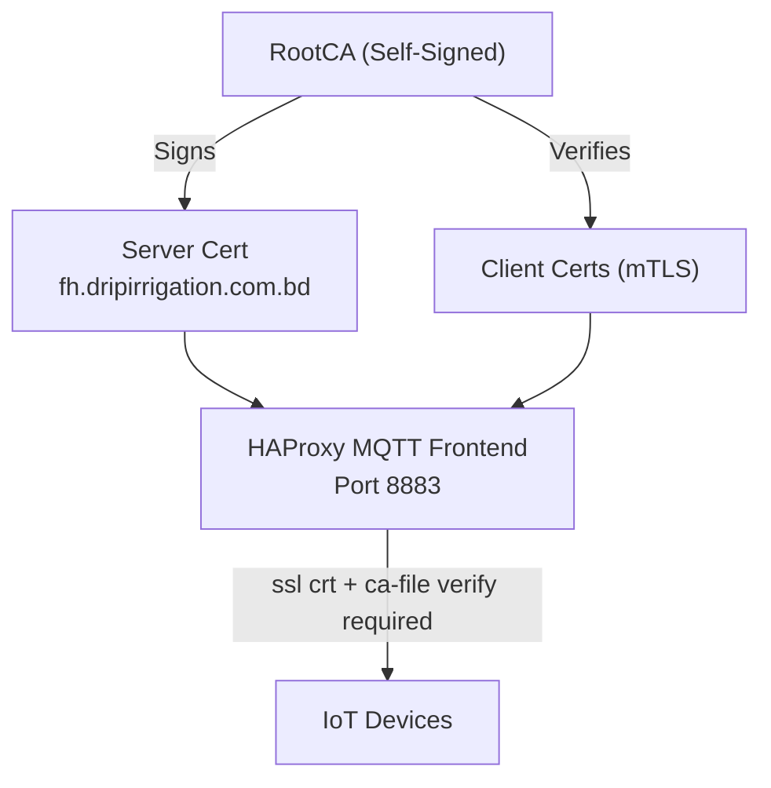
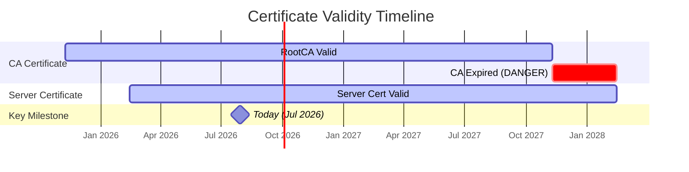

# Server Certificate & PKI Analysis

Analysis of the TLS certificates embedded in [docker-compose.coolify.yml](file:///home/arif-dibl/Desktop/Arif_Projects/openremotetest_Auto_Provisioning-1/openremotetest_Auto_Provisioning_Updated/DIBL_IOT/docker-compose.coolify.yml).

---

## Architecture Overview

The compose file defines a **mutual TLS (mTLS)** setup for MQTT on port **8883**, using three inline configs:

| Config | Target Path | Purpose |
|---|---|---|
| `mqtt-server-cert` | `/certs/mqtt-server-combined.pem` | Server certificate + private key (combined PEM) |
| `mqtt-ca-cert` | `/certs/ca.pem` | CA certificate for client verification |
| `haproxy-config` | `/data/proxy/haproxy.cfg` | HAProxy configuration referencing the certs |

---

## 🔐 Server Certificate

| Field | Value |
|---|---|
| **Subject** | `C=BD, ST=Dhaka, L=Dhaka, O=DripIrrigation, OU=IoT, CN=fh.dripirrigation.com.bd` |
| **Issuer** | `C=BD, ST=Dhaka, L=Dhaka, O=DripIrrigation, OU=IoT, CN=RootCA` |
| **Serial** | `54:51:08:59:3F:77:B1:2A:29:5A:7A:A4:3B:09:8E:04:28:C6:08:1D` |
| **Version** | v3 |
| **Algorithm** | SHA-256 with RSA (4096-bit) |
| **Not Before** | Feb 14, 2026 04:18:43 UTC |
| **Not After** | **Feb 14, 2028 04:18:43 UTC** |
| **Validity Period** | 2 years |
| **SHA-256 Fingerprint** | `F4:8A:F0:F8:48:41:DF:04:17:84:1F:94:B9:EA:07:5D:FE:27:C4:5D:86:5F:79:A7:2F:BE:A1:8E:C0:60:09:7D` |
| **SHA-1 Fingerprint** | `BD:8E:EF:FA:D6:5A:31:C3:BB:97:BE:A3:DD:FB:9C:E9:66:B9:2C:B4` |

### X.509v3 Extensions

| Extension | Value |
|---|---|
| Subject Alternative Name (SAN) | `DNS:fh.dripirrigation.com.bd` |
| Extended Key Usage | TLS Web Server Authentication |
| Subject Key Identifier | `4B:D6:93:10:4B:C6:9E:91:9C:0A:81:F5:2C:3F:BA:88:F4:70:A4:79` |
| Authority Key Identifier | `AC:80:0E:45:96:93:5F:D7:FC:91:F0:C0:B3:BA:38:4D:49:5C:37:E9` |

---

## 🏛️ CA (Root) Certificate

| Field | Value |
|---|---|
| **Subject** | `C=BD, ST=Dhaka, L=Dhaka, O=DripIrrigation, OU=IoT, CN=RootCA` |
| **Issuer** | Same as Subject (**self-signed**) |
| **Serial** | `48:83:B9:6A:FF:72:D9:29:E8:60:37:47:EC:9C:BC:AF:FB:8C:23:4A` |
| **Version** | v3 |
| **Algorithm** | SHA-256 with RSA (4096-bit) |
| **Not Before** | Nov 9, 2025 05:45:40 UTC |
| **Not After** | **Nov 9, 2027 05:45:40 UTC** |
| **Validity Period** | 2 years |
| **Basic Constraints** | `CA:TRUE` (critical) |
| **SHA-256 Fingerprint** | `40:3A:0C:13:86:71:C3:BB:39:D6:A1:67:DE:92:44:9C:A9:AD:5D:0D:38:51:71:66:01:47:58:F5:16:AF:22:FA` |
| **SHA-1 Fingerprint** | `2C:8B:EA:AA:26:55:7C:3D:92:10:F7:AA:5A:2D:A1:8E:EA:A0:ED:C0` |

---

## ✅ Verification Results

| Check | Result | Details |
|---|---|---|
| **Chain Validation** | ✅ **OK** | Server cert → RootCA chain verified successfully |
| **Key Match** | ✅ **Match** | Private key public key MD5: `015e486ce5beb5100989f933ec4aa4e0` matches certificate |
| **Server Cert Validity** | ✅ Valid | Currently valid (as of Jul 2026), expires Feb 2028 |
| **CA Cert Validity** | ✅ Valid | Currently valid (as of Jul 2026), expires Nov 2027 |
| **Key Strength** | ✅ Strong | 4096-bit RSA keys on both certs |
| **Signature Algorithm** | ✅ Modern | SHA-256 (no deprecated SHA-1) |

---

## ⚠️ Findings & Observations

> [!WARNING]
> ### CA Certificate Expires Before Server Certificate
> The **CA certificate expires on Nov 9, 2027**, but the **server certificate is valid until Feb 14, 2028**. Once the CA expires, the server certificate will no longer be verifiable against it, effectively breaking the mTLS chain **~3 months before** the server cert itself expires.
>
> **Action**: Renew the CA certificate before Nov 2027 and re-sign the server cert.

> [!WARNING]
> ### Private Key Embedded in Docker Compose
> The server's **RSA private key is stored in plaintext** within the compose file ([lines 109–160](file:///home/arif-dibl/Desktop/Arif_Projects/openremotetest_Auto_Provisioning-1/openremotetest_Auto_Provisioning_Updated/DIBL_IOT/docker-compose.coolify.yml#L109-L160)). If this file is committed to version control, the private key is exposed to anyone with repository access.
>
> **Action**: Consider using Docker secrets, environment variable injection, or a secrets manager.

> [!IMPORTANT]
> ### Self-Signed CA — Trust Distribution Required
> The RootCA is self-signed, meaning IoT devices must be **pre-provisioned** with this CA certificate to establish trust. Devices without the CA cert will reject the MQTT TLS connection.

> [!NOTE]
> ### HAProxy mTLS Configuration
> The HAProxy frontend at [line 51](file:///home/arif-dibl/Desktop/Arif_Projects/openremotetest_Auto_Provisioning-1/openremotetest_Auto_Provisioning_Updated/DIBL_IOT/docker-compose.coolify.yml#L51) uses `verify required`, enforcing mutual TLS. Only clients presenting a certificate signed by the same RootCA will be allowed to connect via MQTT on port 8883.

---

## 📅 Expiration Timeline

> [!CAUTION]
> The red zone in the timeline shows the **gap period (Nov 2027 – Feb 2028)** where the server cert is still valid but the CA has expired — mTLS will fail during this window.
